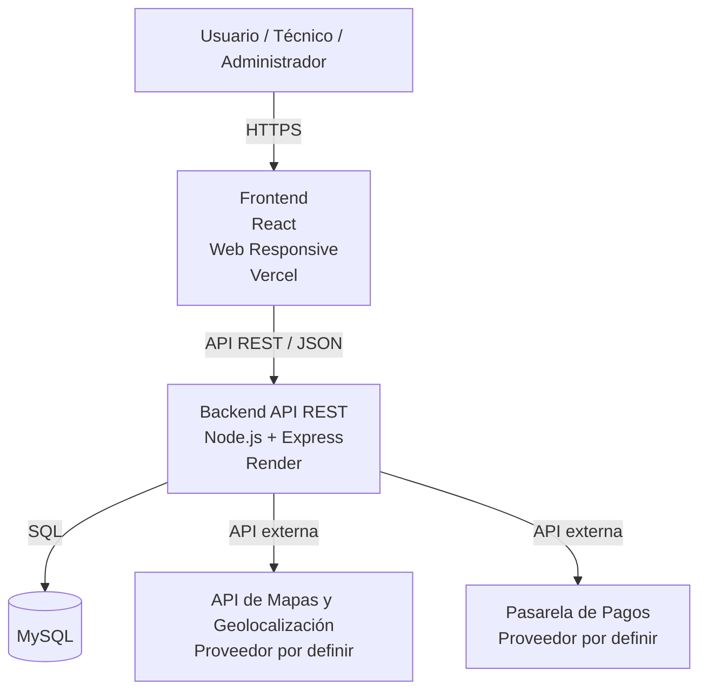

# Arquitectura Técnica Inicial de FixIT

## 1. Descripción general

FixIT utilizará una arquitectura cliente-servidor que separa la interfaz de usuario, la lógica de negocio y la persistencia de datos.

La aplicación web responsive será desarrollada con React y se comunicará mediante HTTPS con una API REST implementada utilizando Node.js y Express.

La información persistente será almacenada en MySQL. La arquitectura contempla además integraciones externas para servicios de geolocalización y procesamiento de pagos.

## 2. Diagrama de arquitectura

## 3. Responsabilidades de cada componente

### Frontend
Tecnologías:
- React
- HTML
- CSS
- JavaScript

Responsabilidades:
- Interfaz web responsive.
- Registro e inicio de sesión.
- Registro de incidencias.
- Triaje guiado.
- Visualización de técnicos compatibles.
- Consulta del perfil del técnico.
- Selección de modalidad.
- Agendamiento.
- Confirmación del servicio.

### Backend

Tecnologías:
- Node.js
- Express

Responsabilidades:
- Lógica de negocio.
- Gestión de usuarios y técnicos.
- Procesamiento de incidencias.
- Triaje.
- Matching de técnicos.
- Gestión de disponibilidad y citas.
- Gestión de pagos y comisiones.
- Comunicación con servicios externos.

### Base de datos

Tecnología:
- MySQL

Información prevista:
- Usuarios.
- Técnicos.
- Especialidades.
- Incidencias.
- Resultados de triaje.
- Citas.
- Servicios.
- Pagos.
- Calificaciones.
- Garantías.

### Servicios externos

#### Mapas y geolocalización
Permitirá:
- Obtener ubicación aproximada.
- Calcular distancias.
- Apoyar la búsqueda de técnicos cercanos.

El proveedor será definido posteriormente.

#### Pasarela de pagos
Permitirá procesar los pagos realizados a través de FixIT.

El proveedor será definido posteriormente.

FixIT no almacenará directamente los datos de tarjetas de los usuarios.

## 4. Herramientas del proyecto

| Área | Herramienta |
|---|---|
| Gestión | Jira Software |
| UX/UI | Figma |
| Frontend | React |
| Backend | Node.js + Express |
| Base de datos | MySQL |
| Control de versiones | Git + GitHub |
| Pruebas API | Postman |
| Despliegue frontend | Vercel |
| Despliegue backend | Render |
| Geolocalización | API externa por definir |
| Pagos | Pasarela externa por definir |

## 5. Estrategia de ramas

El repositorio utiliza inicialmente:

- `main`: versión estable del proyecto.
- `develop`: rama principal de integración.

Durante los siguientes Sprints se podrán crear ramas temporales del tipo:

- `feature/registro-usuario`
- `feature/triaje`
- `feature/matching`

Estas ramas se crearán cuando comience el desarrollo de cada funcionalidad.

## 6. Estado de los entornos en Sprint 0

| Elemento | Estado |
|---|---|
| Jira | Configurado |
| GitHub | Configurado |
| Rama main | Configurada |
| Rama develop | Configurada |
| Figma | En elaboración |
| Entorno de desarrollo local | Pendiente de verificación |
| MySQL | Planificado |
| Vercel | Planificado |
| Render | Planificado |
| API de mapas | Proveedor por definir |
| Pasarela de pagos | Proveedor por definir |

## 7. Justificación técnica

Se seleccionó una arquitectura cliente-servidor porque permite separar las responsabilidades de interfaz, lógica de negocio y persistencia.

React permitirá desarrollar una interfaz web responsive, mientras que Node.js y Express permitirán implementar una API REST para centralizar la lógica de negocio.

MySQL fue seleccionado debido a que FixIT manejará principalmente información estructurada y relacionada, como usuarios, técnicos, especialidades, incidencias, citas, pagos y calificaciones.

La separación de frontend, backend y base de datos permitirá desarrollar e integrar funcionalidades progresivamente durante los siguientes Sprints.
